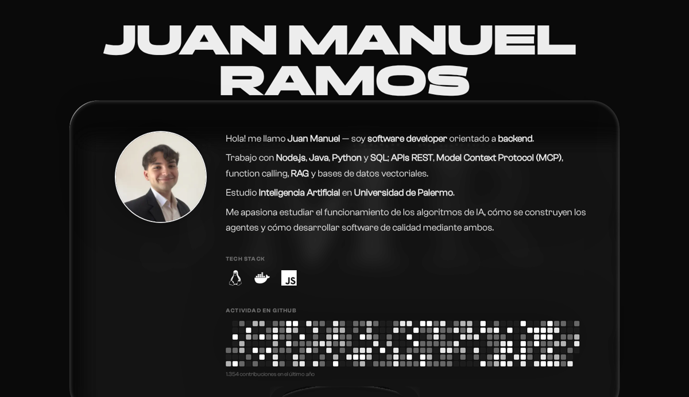
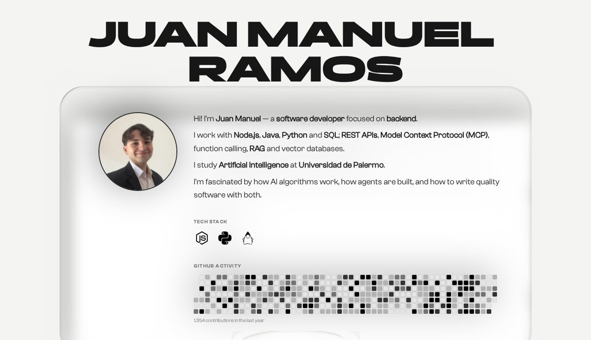
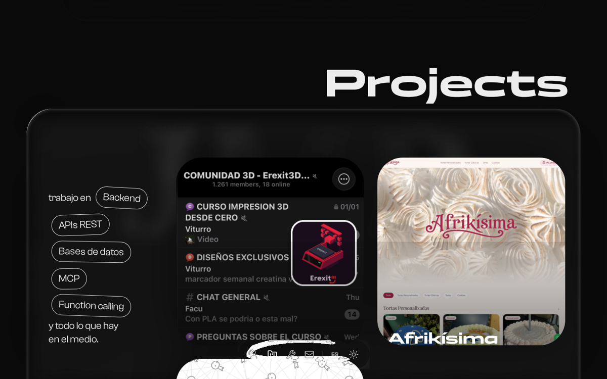
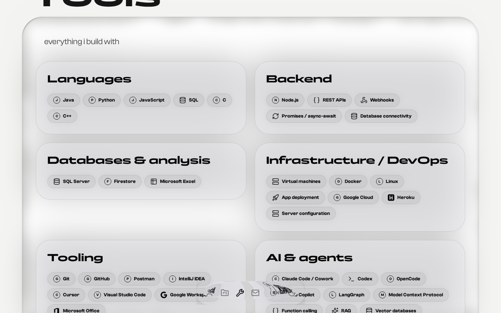

# Portafolio — Juan Manuel Ramos

**Español** · [English](README.en.md)

Portafolio personal de **Juan Manuel Ramos**, software developer orientado a backend.
Sitio de una sola página, bilingüe (español / inglés), con modo claro y oscuro.

[](https://nextjs.org/)
[](https://react.dev/)
[](https://www.typescriptlang.org/)
[](https://tailwindcss.com/)
[](https://gsap.com/)



---

## Contenido

- [Qué incluye](#qué-incluye)
- [Stack](#stack)
- [Capturas](#capturas)
- [Puesta en marcha](#puesta-en-marcha)
- [Estructura del proyecto](#estructura-del-proyecto)
- [Agregar o editar un proyecto](#agregar-o-editar-un-proyecto)
- [Traducciones](#traducciones)
- [Iconos](#iconos)
- [Despliegue](#despliegue)
- [Contacto](#contacto)
- [Créditos y licencia](#créditos-y-licencia)

---

## Qué incluye

| | |
|---|---|
| 🌐 **Bilingüe** | Arranca en el idioma del navegador y se puede cambiar con el botón `ES/EN`. La elección se recuerda entre visitas. |
| 🌗 **Claro y oscuro** | Sigue la preferencia del sistema, con interruptor manual. |
| 🗂️ **Fichas de proyecto** | Cada tarjeta abre un modal con contexto, impacto, funcionalidades y stack. |
| 🎬 **Preview en vivo** | Las tarjetas reproducen un recorrido del sitio real al pasar el mouse (o al centrarse en pantalla, en móvil). |
| 📊 **Actividad de GitHub** | Calendario de contribuciones del último año, que se adapta al ancho disponible. |
| ✨ **Animaciones** | Scroll suave con Lenis, títulos y parallax con GSAP ScrollTrigger, tarjetas con efecto *liquid glass*. |
| 📱 **Responsive** | Diseñado para móvil, tablet y escritorio. |

## Stack

**Framework** — Next.js 16 (App Router) · React 19 · TypeScript 5
**Estilos** — Tailwind CSS v4 · fuentes locales (Panchang, Clash Grotesk, Expose)
**Animación** — GSAP + ScrollTrigger · Framer Motion · Lenis
**Otros** — `react-activity-calendar` · `lucide-react` · iconos de marca vía [Simple Icons](https://simpleicons.org/)

## Capturas

<details>
<summary>Ver más capturas</summary>

**Hero en modo claro**



**Proyectos**



**Herramientas**



</details>

## Puesta en marcha

Requisitos: **Node.js 20 o superior**.

```bash
npm install
npm run dev      # http://localhost:3000
```

Otros comandos:

```bash
npm run build    # build de producción
npm start        # sirve el build
npm run lint     # ESLint
```

## Estructura del proyecto

```
app/
  layout.tsx           metadata, fuentes, fondo animado, providers
  page.tsx             composición de las secciones
  globals.css          estilos base y variables de fuentes
  fonts.ts             carga de las fuentes locales

sections/
  Hero.tsx             presentación, tech stack y actividad de GitHub
  Projects.tsx         grilla de proyectos + modal de detalle
  tools.tsx            stack agrupado por categoría

components/
  projectCard.tsx      tarjeta con preview en video
  projectDetail.tsx    modal con impacto, funcionalidades y stack
  GitHubCommits.tsx    calendario de contribuciones
  BottomNav.tsx        navegación flotante, idioma y tema
  LiquidGlassCard.tsx  tarjetas con efecto de vidrio
  GlassSurface.tsx     superficie de vidrio de la navegación
  tech-icons.tsx       iconos SVG del carrusel del hero
  logo-carousel.tsx    carrusel animado de tecnologías
  preloader.tsx        pantalla de carga
  lenis-provider.tsx   scroll suave

lib/
  i18n.tsx             diccionarios ES/EN y contexto de idioma
  projects.ts          tipos de proyecto y lista de slugs
  utils.ts             helpers

public/
  projects/<slug>/     image.png · showcase.webm · project.json
  icons/               logos monocromos propios
  fonts/               fuentes en woff2
  background-*.webm    fondo animado (claro y oscuro)
  avatar.jpg           foto de perfil
```

## Agregar o editar un proyecto

Cada proyecto vive en su propia carpeta bajo `public/projects/`. No hace falta tocar
componentes: alcanza con los archivos y una línea en `lib/projects.ts`.

**1. Crear la carpeta** `public/projects/mi-proyecto/` con:

| Archivo | Requerido | Detalle |
|---|---|---|
| `image.png` | Sí | Imagen cuadrada, idealmente 900 × 900 px. |
| `project.json` | Sí | Contenido del proyecto (ver abajo). |
| `showcase.webm` | No | Video 16:9 que se reproduce en el hover. |

**2. Escribir `project.json`:**

```json
{
  "title": "Mi Proyecto",
  "tags": ["Node.js", "TypeScript"],
  "stack": ["Node.js", "TypeScript", "PostgreSQL"],
  "githubUrl": "https://github.com/juanm4ram/mi-proyecto",
  "previewUrl": "https://mi-proyecto.com",
  "hasVideo": true,
  "es": {
    "subtitle": "Subtítulo corto",
    "description": "Una línea para la tarjeta.",
    "overview": "Párrafo de contexto para el modal.",
    "impact": "El resultado concreto del proyecto.",
    "features": ["Primera funcionalidad", "Segunda funcionalidad"]
  },
  "en": {
    "subtitle": "Short subtitle",
    "description": "One line for the card.",
    "overview": "Context paragraph for the modal.",
    "impact": "The concrete outcome of the project.",
    "features": ["First feature", "Second feature"]
  }
}
```

`title`, `tags`, `stack` y las URLs son comunes a los dos idiomas.
`githubUrl` y `previewUrl` son opcionales: si faltan, el icono correspondiente no se
muestra. `hasVideo` sólo hace falta si incluiste `showcase.webm`.

**3. Registrar el slug** en `lib/projects.ts`:

```ts
export const projectSlugs = ["erexit-3d", "afrikisima", "redes-neuronales", "mi-proyecto"];
```

## Traducciones

Todos los textos de interfaz salen de `lib/i18n.tsx`. Para agregar uno:

```ts
const es = {
  // …
  "footer.newLine": "Texto nuevo",
} as const;
```

El tipo de las claves se deriva del diccionario español, así que **TypeScript va a
marcar un error hasta que agregues la misma clave en `en`**. Después se usa así:

```tsx
const { t } = useLang();
<p>{t("footer.newLine")}</p>
```

El idioma se resuelve en este orden: lo guardado en `localStorage` → el idioma del
navegador (`navigator.languages`) → inglés como último recurso.

## Iconos

- **Marcas conocidas:** `https://cdn.simpleicons.org/<slug>/<color>`, con la inicial
  dentro de un círculo como respaldo si el icono no carga.
- **Conceptos sin marca** (APIs REST, webhooks, máquinas virtuales…): iconos de
  [lucide-react](https://lucide.dev/).
- **Marcas que Simple Icons no incluye** (Heroku, Google Workspace, Microsoft Office):
  PNG monocromos en `public/icons/`, teñidos con `filter: invert(1)` en modo oscuro.

## Despliegue

El proyecto es una app de Next.js estándar y no necesita variables de entorno.

**Vercel** — importar el repositorio desde GitHub; el framework se detecta solo
(`next build` como comando de build, `.next` como directorio de salida).

**Otros hosts** — `npm run build` y luego `npm start` sobre Node.js 20+.

## Contacto

- 📧 [juanmanuelramos813@gmail.com](mailto:juanmanuelramos813@gmail.com)
- 💼 [linkedin.com/in/juanmramos3](https://www.linkedin.com/in/juanmramos3/)
- 💻 [github.com/juanm4ram](https://github.com/juanm4ram)

## Créditos y licencia

El diseño base proviene de [portfolio-2026](https://github.com/yass-gr/portfolio-2026),
de Yassine Grairi. El contenido, los proyectos, la sección de herramientas, el sistema
bilingüe y las imágenes son propios.

Las fuentes Panchang, Clash Grotesk y Expose son de
[Indian Type Foundry / Fontshare](https://www.fontshare.com/) y se usan bajo su licencia.
